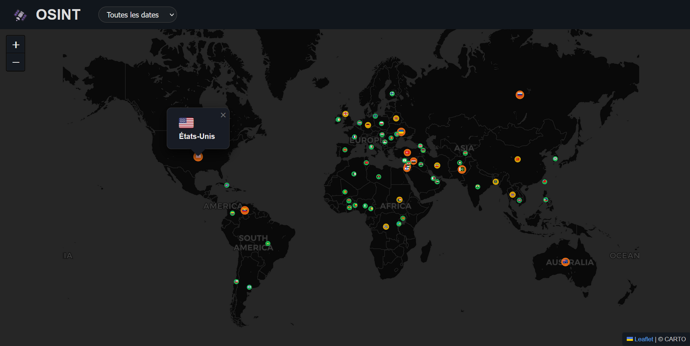

# 🛰️ OSINT Telegram Dashboard




Application FastAPI qui collecte des événements depuis des canaux Telegram, les traduit, les enrichit (géolocalisation / métadonnées), puis les affiche sur un planisphère interactif.
Le pipeline est entièrement automatisé via GitHub Actions (secrets gérés via GitHub Secrets) et le projet est conçu pour être déployé facilement sur un hébergeur compatible.
---

## 🎯 Fonctionnalités principales

- **Collecte Telegram** : Récupère les messages des canaux Telegram sur 24h.
- **Déduplication** : Nettoie les doublons pour une base de données propre.
- **Traduction & enrichissement** : Utilise l'API OpenAI pour traduire et extraire des informations clés (pays, région, titre, etc.).
- **Stockage** : Sauvegarde dans une base SQLite via SQLModel.
- **API REST** : Expose les données pour le dashboard (dates, pays, événements).
- **Dashboard web** : Visualisation interactive des événements sur une carte (Leaflet.js).

---

## 🏗️ Structure du projet

- `app/` : Backend FastAPI, logique métier, API, modèles, services
- `tools/` : Scripts CLI (init Telegram, export, pipeline)
- `static/` : Fichiers statiques (JS, CSS, données pays)
- `templates/` : Template HTML du dashboard
- `data/` : Base SQLite et exports

---

## 💾 Installation

1. Créez un environnement virtuel Python 3.10+ :
   ```bash
   python3 -m venv .venv
   source .venv/bin/activate
   pip install -r requirements.txt
   ```
2. Copiez `.env.example` en `.env` et renseignez vos clés Telegram & OpenAI.

---

## 🚀 Lancement

- **Initialisation session Telegram** :
   ```bash
   python tools/init_telegram.py
   ```
- **Pipeline Telegram → DB** :
   ```bash
   python tools/run_pipeline.py
   ```
- **API & dashboard** :
   ```bash
   uvicorn app.main:app --reload
   ```
- **Export CSV** :
   ```bash
   python tools/export_messages.py
   ```

---

## ⚙️ Configuration

Voir `.env.example` pour les variables nécessaires :
- Clés Telegram & OpenAI
- SOURCES_TELEGRAM : liste des canaux à surveiller
- Model OpenAI
- Nombre max msg/jours
- Batch size

---

## 📄 Licence

Projet open-source, usage libre.
