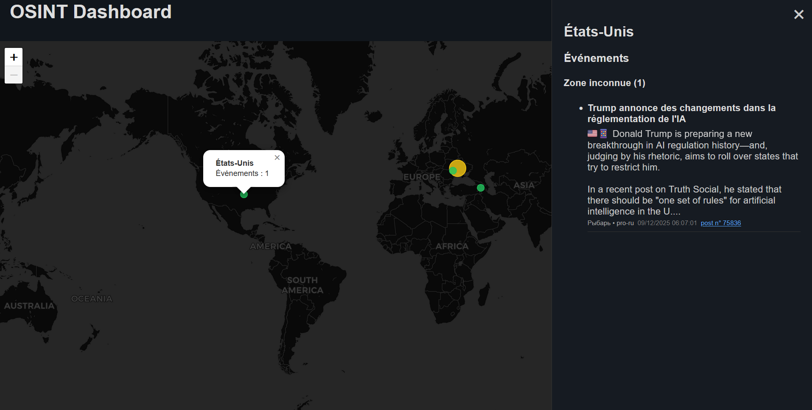

# 🛰️ OSINT Telegram Dashboard



Ce projet est une application FastAPI permettant de collecter, traduire, enrichir et afficher des événements provenant de sources Telegram sur un planisphère interactif.

---

## 🎯 Fonctionnalités principales

- **Collecte Telegram** : Récupère les messages des canaux Telegram sur 24h.
- **Traduction & enrichissement** : Utilise l'API OpenAI pour traduire et extraire des informations clés (pays, région, titre, etc.).
- **Déduplication** : Nettoie les doublons pour une base de données propre.
- **Stockage** : Sauvegarde dans une base SQLite via SQLModel.
- **API REST** : Expose les données pour le dashboard (dates, pays, événements).
- **Dashboard web** : Visualisation interactive des événements sur une carte (Leaflet.js).

---

## 🗃️ Structure du projet

- `app/` : Backend FastAPI, logique métier, API, modèles, services
- `tools/` : Scripts CLI (init Telegram, export, pipeline)
- `static/` : Fichiers statiques (JS, CSS, données pays)
- `templates/` : Template HTML du dashboard
- `data/` : Base SQLite et exports

---

## ⚙️ Installation

1. Créez un environnement virtuel Python 3.10+ :
   ```bash
   python3 -m venv .venv
   source .venv/bin/activate
   pip install -r requirements.txt
   ```
2. Copiez `.env.example` en `.env` et renseignez vos clés Telegram & OpenAI.

---

## 🚀 Lancement

- **Initialisation session Telegram** :
   ```bash
   python tools/init_telegram.py
   ```
- **Pipeline Telegram → DB** :
   ```bash
   python tools/run_pipeline.py
   ```
- **API & dashboard** :
   ```bash
   uvicorn app.main:app --reload
   ```
- **Export CSV** :
   ```bash
   python tools/export_messages.py
   ```

---

## 🔧 Configuration

Voir `.env.example` pour les variables nécessaires :
- Clés Telegram & OpenAI
- SOURCES_TELEGRAM : liste des canaux à surveiller
- Model OpenAI
- Nombre max msg/jours
- Batch size

---

## 🎨 Frontend

- Carte Leaflet, affichage par pays, événements détaillés par zone
- Fichiers : `static/js/dashboard.js`, `static/css/dashboard.css`, `static/data/countries.json`

---

## 📄 Licence

Projet open-source, usage libre.
